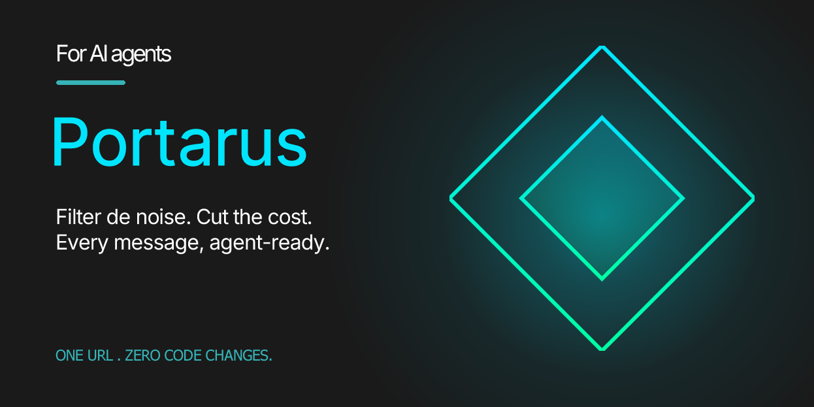

<div align="center">



### The signal layer between your message source and your AI agent.

[](#)
[](#)
[](#)
[](#)

</div>

---

## Get started

> **1.** Create an account at [portarus.com](https://portarus.com)
>
> **2.** Create a gateway — pick your source, your destination, and paste your agent's endpoint
>
> **3.** Copy the **Gateway URL**: `gateway.portarus.com/g/{slug}`
>
> **4.** Replace the webhook URL in your message source. **That's it.**

Your agent now receives *filtered, deduplicated, unified* messages — each one with a full **audit envelope** attached.

---

## What your agent receives

Every delivered message includes the original payload **plus** a `_portarus` envelope with the full processing result.

**You decide what happens to junk:** block it entirely (goes to quarantine — reviewable and replayable), *or* receive it anyway with the `_portarus` envelope telling your app exactly *why* it was flagged, so your code decides.

<table width="100%">
<tr>
<th width="50%">Before — raw payload</th>
<th width="50%">After — with Portarus</th>
</tr>
<tr>
<td valign="top">

```
{                                                  
  "user_id":    "user_823",               
  "message":    "I need help with billing",
  "timestamp":  "2026-09-08T14:30:00.000Z"
}                                                  
```


</td>
<td valign="top">

```diff
 {                                                  
   "user_id":    "user_823",               
   "message":    "I need help with billing",
   "timestamp":  "2026-09-08T14:30:00.000Z",
+  "_portarus": {                           
+      "user":            "user_823",   
+      "message_unified": "...",          
+      "status":          { "processed": true },
+      "security": {                      
+          "result":     "pass",     
+          "rate_limit": "pass",         
+          "dedup":      "pass",       
+          "max_tokens": "pass"         
+      },                                 
+      "keyword_routing": { "matched": false },
+      "latency_ms": 47                
+  }                                   
 }                                                  
```

</td>
</tr>
</table>

Your agent parses `_portarus` to know *exactly* what happened — was it processed? was it flagged? was it routed? Every decision is **traceable**.

---

## Why Portarus

### The problem


*The raw stream lands straight on your agent. Junk in, junk out — and your agent (and your bill) absorbs every bit of it.*

Your AI agent receives messages **straight from the source** — WhatsApp, Telegram, Slack, whatever. No filter, no shield. Whatever gets sent, your agent *has to deal with it*:

| | What happens | What it costs you |
|---|---|---|
| **Sliced messages** | *"hi"* + *"I have a question"* + *"about pricing"* = **3 LLM calls** | 3x token spend, fragmented context |
| **Duplicates** | Same message sent twice (retries, double-taps) | Wasted processing, confused responses |
| **Bot spam** | Automated noise, crawlers, junk | Burned tokens on garbage |
| **Token bombs** | Oversized payloads (pasted docs, base64 blobs) | Blown context windows, high costs |


### The fix


**Portarus sits in front of your agent** — *unifying, protecting, and routing every message. Your agent only ever sees a clean, ready-to-use payload.*

Everything is **fully customizable** per gateway. You set the thresholds. You pick the behavior. You control what gets through.

| What you get | How it works |
|---|---|
| **Simplified workflow** | *One URL* replaces your webhook — everything else stays the same |
| **Protected agent** | Rate limiting, dedup, and token budgets **block the noise** before it reaches you |
| **Unified messages** | Rapid-fire messages batched into *one payload* — **better context** for your AI |
| **Smart routing** | Route by keyword to different endpoints, **blacklist** abusive users, review everything filtered |
| **Full audit trail** | Every message carries a `_portarus` envelope — your agent *knows* what happened |


> Replace **one** webhook URL. *No SDK, no code changes, no deploy.*

---

## Docs

Full documentation at [**portarus.com/docs**](https://portarus.com/docs).

| I want to... | |
|---|---|
| Set up my first gateway | [**Quick Start**](https://portarus.com/docs#quickstart) |
| Configure rate limits, dedup, or token budget | [**Filters**](https://portarus.com/docs#filters) |
| Batch rapid-fire messages into one | [**Message Unification**](https://portarus.com/docs#unification) |
| Route messages by keyword | [**Keyword Routing**](https://portarus.com/docs#routing) |
| Share a gateway with my team | [**Sharing**](https://portarus.com/docs#sharing) |
| Understand my traffic metrics | [**Insights**](https://portarus.com/docs#insights) |
| Debug a blocked or missing message | [**Troubleshooting**](https://portarus.com/docs#troubleshooting) |
| Read the full delivery envelope spec | [**Envelope Reference**](https://portarus.com/docs#envelope) |

---

## Stats

| | |
|---|---|
| **Response time** | `202 Accepted` in **<100ms** at the edge |
| **Global edge** | Cloudflare Workers — **300+ cities** worldwide |
| **Test suite** | **1,363 tests** passing (unit + security + integration + performance) |
| **Fail-open** | Your agent *always* receives its messages — infrastructure failures **never** block delivery |
| **Encryption** | AES-256-GCM at rest, HMAC-signed gateway URLs, SSRF protection on all outbound calls |
| **Delivery** | Async with retry — your source gets `202` immediately, your agent gets the payload in the background |

---

<div align="center">

[**portarus.com**](https://portarus.com) · [**Docs**](https://portarus.com/docs) · [hello@cogmus.com](mailto:hello@cogmus.com)

© 2026 Cogmus. All rights reserved.

</div>
